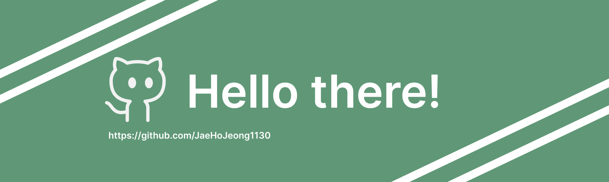

<h1 align="center">Hi 👋, I'm JaeHo Jeong</h1>
<h1 align="center">게임엔진 → 인공지능</h3>

  

- 현재 공부중인 것들 **python, keras.v2, pytorch, keras.v1, docker**
- 과거에 공부했던 것들 **C++, UE4, UE5, C#, Unity**

- 📫 연락처 **jjeaho22@gmail.com**

<h3 align="left">Connect with me:</h3>
Email please

 
<h3 align="left">[대회 참여 이력]:</h3>
<h5>- 갑상선암 진단 분류 해커톤 : 양성과 악성, AI로 정확히 구분하라! (Public 19등/988)</h5>
<h5>- Boost up AI 2025 : 신약 개발 경진대회 (Public 28등/1283)</h5>
<h5>- Jump AI(.py) 2025 : 제 3회 AI 신약개발 경진대회(Private 43등/1119)</h5>
<h5>- 2025 전력사용량 예측 AI 경진대회 (Private 6등/1566)</h5>
<h5>- 데이콘 Basic 스트레스 지수 예측 : 건강 데이터로 마음의 균형을 찾아라! (최종 3등/621)</h5>
<h5>- 2025 금융 AI Challenge : 금융 AI 모델 경쟁 (Public 139등/1061)</h5>
<h5>- 2025 동원 x 카이스트 AI Competition: Unlocking Future Sales & Demographics (Public 12등/666)</h5>
<h5>- 데이콘 Basic 고객 지원 등급 분류 : 도움이 필요한 고객을 찾아라! (Private 31등/517)</h5>
 
<h3 align="left">Languages and Tools:</h3>
  

 
  
  
  
  
    
  
  
   

&nbsp;

